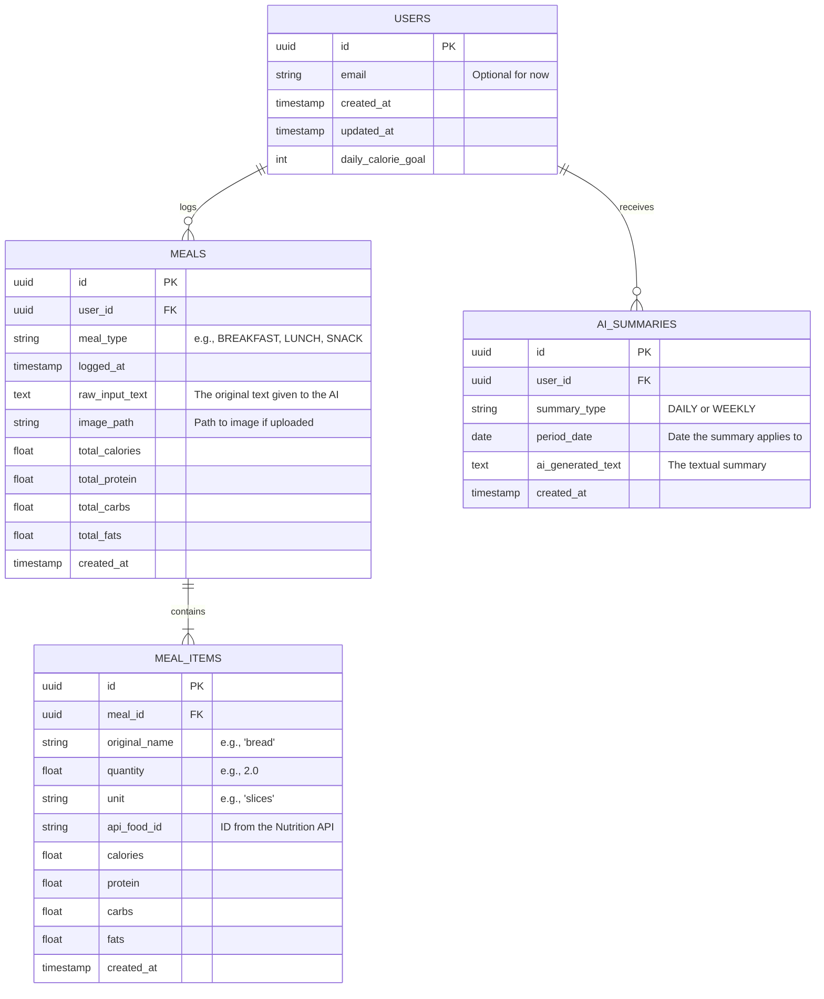

# Application Database Schema

This document outlines the professional relational database schema for the **AI Nutrition Logger**. It provides tracking for user meals, individual food item macros fetched from external APIs, and the generated AI summaries.

## Entity-Relationship Diagram

## Table Definitions

### 1. `users`
*(Even if authentication is secondary, it is best practice to associate meals with a user UUID immediately for local or future cloud storage).*

| Column Name | Type | Constraints | Description |
| :--- | :--- | :--- | :--- |
| `id` | UUID | Primary Key | Unique identifier for the user. |
| `email` | VARCHAR(255) | Unique, Nullable | Ready for future authentication. |
| `daily_calorie_goal`| INT | Nullable | User's daily calorie target for comparison. |
| `created_at` | TIMESTAMP | Not Null | When the local profile was created. |
| `updated_at` | TIMESTAMP | Not Null | When the user profile was last updated. |

### 2. `meals`
*(Represents a single logging event, encompassing multiple potential food items).*

| Column Name | Type | Constraints | Description |
| :--- | :--- | :--- | :--- |
| `id` | UUID | Primary Key | Unique identifier for the meal. |
| `user_id` | UUID | Foreign Key | References `users(id)`. |
| `meal_type` | VARCHAR(50) | Not Null | Categorization: "BREAKFAST", "LUNCH", "DINNER", "SNACK". |
| `logged_at` | TIMESTAMP | Not Null | The actual time the meal was consumed. |
| `raw_input_text` | TEXT | Nullable | The original text phrase typed by the user (e.g., "I just had 2 eggs and toast"). |
| `image_path` | VARCHAR(255) | Nullable | Reference path if an image was uploaded (`/data/raw/...`). |
| `total_calories` | FLOAT | Default 0 | Pre-aggregated total calories for quick querying. |
| `total_protein` | FLOAT | Default 0 | Pre-aggregated total protein. |
| `total_carbs` | FLOAT | Default 0 | Pre-aggregated total carbohydrates. |
| `total_fats` | FLOAT | Default 0 | Pre-aggregated total fats. |
| `created_at` | TIMESTAMP | Not Null | When the record was inserted. |

### 3. `meal_items`
*(Represents the specific, AI-extracted food items, resolved against a Nutrition API).*

| Column Name | Type | Constraints | Description |
| :--- | :--- | :--- | :--- |
| `id` | UUID | Primary Key | Unique identifier for the item. |
| `meal_id` | UUID | Foreign Key | References `meals(id)`. |
| `original_name` | VARCHAR(255) | Not Null | The item name extracted by the AI (e.g., "whole wheat bread"). |
| `quantity` | FLOAT | Not Null | The extracted numerical quantity (e.g., `2.0`). |
| `unit` | VARCHAR(50) | Not Null | The extracted unit (e.g., "pieces", "grams", "tbsp"). |
| `api_food_id` | VARCHAR(100) | Nullable | The matched ID from the external Nutrition API. |
| `calories` | FLOAT | Not Null | Calories specific to this quantity. |
| `protein` | FLOAT | Not Null | Protein (g) specific to this quantity. |
| `carbs` | FLOAT | Not Null | Carbohydrates (g) specific to this quantity. |
| `fats` | FLOAT | Not Null | Fats (g) specific to this quantity. |
| `created_at` | TIMESTAMP | Not Null | When the record was inserted. |

### 4. `ai_summaries`
*(Stores the AI-generated health metrics and encouraging advice).*

| Column Name | Type | Constraints | Description |
| :--- | :--- | :--- | :--- |
| `id` | UUID | Primary Key | Unique identifier for the summary. |
| `user_id` | UUID | Foreign Key | References `users(id)`. |
| `summary_type` | VARCHAR(20) | Not Null | Usually "DAILY" or "WEEKLY". |
| `period_date` | DATE | Not Null | The specific day or start-of-week it refers to. |
| `ai_generated_text`| TEXT | Not Null | The prose generated by the AI (e.g., "You hit your protein goals today!"). |
| `created_at` | TIMESTAMP | Not Null | When the summary was generated. |

## Important Design Decisions

1. **Denormalization for Speed**: The `meals` table stores aggregated `total_calories`, `total_protein`, etc. While this data could be calculated on the fly by summing up rows in `meal_items`, saving the rolled-up stats makes retrieving daily totals considerably faster.
2. **API Audit Trail**: `meal_items` captures `api_food_id` alongside the user's `original_name`. This allows you to audit the Nutrition API's matches later on if an automatic match was completely wrong.
3. **Preserving Inputs**: Storing the `raw_input_text` allows you to later tweak your AI parsing prompts and compare historical data parsing against new models.
